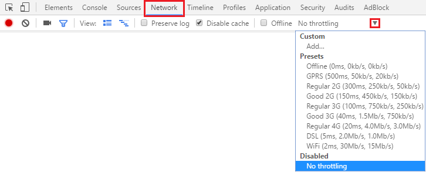

Emulateur de trafic (Google Chrome) 
=================================== 
 
Introduction 
------------ 
| Il peut être intéressant, pour un site internet, de pouvoir s'adapter au type de connexion dont l'utilisateur dispose. Grâce à cet outil, vous allez pouvoir tester un site à l'aide d'une variété de connexions. 
| Cet outil vous permet de faire varier le débit de download, le débit d'upload et même le round-trip-time (RTT). 
| En effet, si la connexion est faible et que la page met trop de temps à charger, l'utilisateur risque de partir. 
| Plusieurs travaux ont prouvé qu'un site a 50ms (1/20 de seconde !) pour faire une bonne première impression [#]_. 
| Si ce genre d'article vous intéresse, je vous conseille aussi l'article '*Powers of 10 : Time Scales in User Experience*' [#]_. 
 
Comment le serveur sait-il que vous avez une connexion à bas débit ? 
-------------------------------------------------------------------- 
| Il existe différents moyens que vous pouvez mettre en place.  
| Une des techniques consiste à vérifier combien de temps met le client pour charger une certaine ressource.  
| Certains fournisseurs ont associé différents range d'adresse IP avec un débit précis.  
 
Le saviez-vous ? 
---------------- 
| Si vous voulez directement passer à la pratique, passez ce paragraphe ! :) 
| Pour être sûr que les équipes de développement de Facebook se sentent concernés par rapport à ce problème, l'entreprise propose à ses employés de simuler une connexion ayant un débit équivalent à une connexion 2G. 
| Cette technique est appelée le '*2G Tuesday*'. La connexion est donc limitée à 40Ko (50Ko étant le débit théorique de la 2G). Pour davantage d'informations googler le terme ou alors rendez-vous sur :  
| http://www.numerama.com/business/128458-facebook-instaure-le-2g-tuesday-pour-se-confronter-au-bas-debit.html 
 
 
Où la trouver ? 
--------------- 
| Avant de se lancer dans le vif du sujet, il est important de noter que l'activation de cette option ne va pas modifier le comportement des autres onglets ouverts. 
| Passons dès à présent à la pratique en utilisant ladite fonctionnalité qu'offre la navigateur Google Chrome. 
| Pour l'atteindre, commencez par ouvrir la console (F12). Ensuite, allez dans l'onglet '*Network*'. 
| A la droite de '*No throttling*' devrait se trouver une petite flèche, celle-ci déploie un menu qui permet de faire varier le débit. Cette option s'appliquera dès que vous changerez de page (un rafraichissement fonctionne aussi) 

| Dans ma version de google chrome, la valeur en ms représente le RTT, ensuite la seconde valeur représente le débit de téléchargement enfin la dernière valeur (souvent inférieure à la précédente) est le débit d'envoi. Dès que l'option est activée, une icône apparait afin de vous en informer. 

|  
| Bien que l'outil de google propose un ensemble limitations par défaut, il est possible que vous vouliez tester le site sous certaines conditions bien précises. Vous pouvez donc ajouter des configurations personnalisées. Dans la première image, vous remarquez l'option '*add*'. Si vous cliquez dessus, vous obtenez ceci 

| Ce menu vous permet aussi de modifier et supprimer les profils déjà créées. 
| Après avoir cliqué sur le bouton d'ajout, un menu se déploie vous permettant de spécifier les débits de download et d'upload ainsi que la latence désirée. 

| Une fois le profil créée, il sera disponible dans la section '*custom*' du menu déroulant. 
 
Et l'option disable chache, à quoi sert-elle ? 
----------------------------------------------- 
| Comme on peut le supposer, cette option va effectivement désactiver le cache. C'est à dire que lorsque vous chargez une page vous allez charger entièrement la page, ce qui inclus toutes les images (même celles déjà chargées), les différentes bibliothèques, ... 
| Désactiver cette option est très utile lorsqu'on développe un site, ou qu'on le débug. Car elle permet de recharger les fichiers de style, les bibliothèques liées, ... 
 
 
Que pouvez-vous faire pour améliorer l'expérience utilisateur ? 
--------------------------------------------------------------- 
| Tout d'abord la première chose à effectuer est d'augmenter le Timeout de certaines requêtes étant donné que celles-ci mettront plus de temps à charger. 
| Changer l'ordre des requêtes pour que le client charge en premier les informations les plus importantes. 
| Limiter les downloads les moins important, voire les supprimer (images, police de caractère, image de fond, ...). 
| Mettre en place un système qui compresse les images, voire plus simplement mettre des images de haute qualité pour les bonnes connexions et des images moins lourdes pour les connexions plus faibles. 
| Une fois ces différents systèmes mis en place n'oubliez pas de les tester grâce à l'émulateur de trafic !  
 
Sources  
------- 
| https://developers.google.com/web/tools/chrome-devtools/network-performance/network-conditions 
| https://ma.ttias.be/simulate-low-bandwidth-conditions-with-chromes-network-throttling/ 
 
 
.. [#] http://www.anaandjelic.typepad.com/files/attention-web-designers-2.pdf 
.. [#] https://www.nngroup.com/articles/powers-of-10-time-scales-in-ux/

